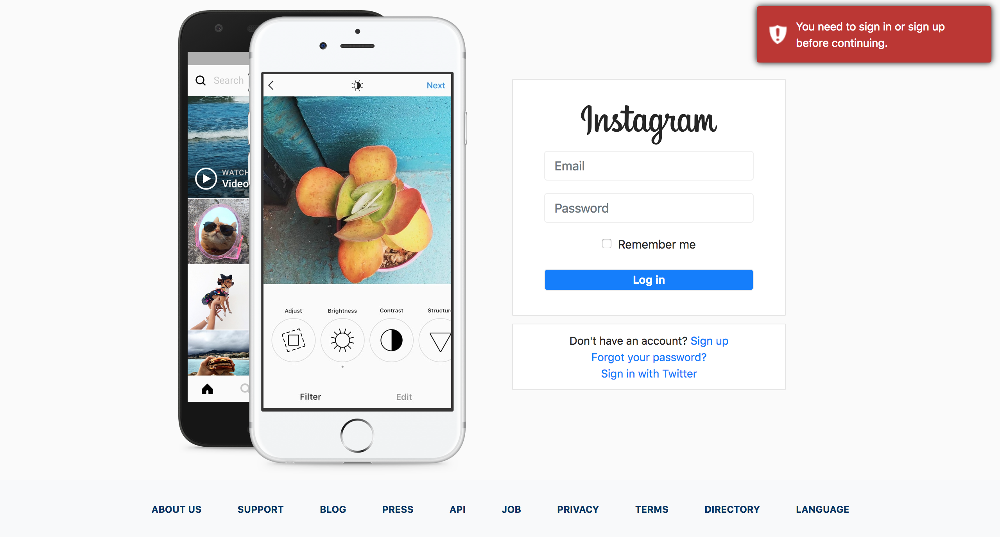
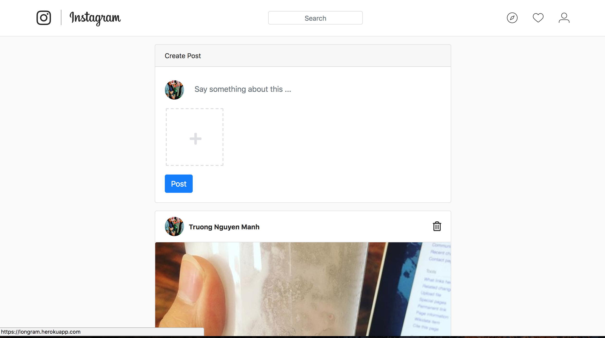
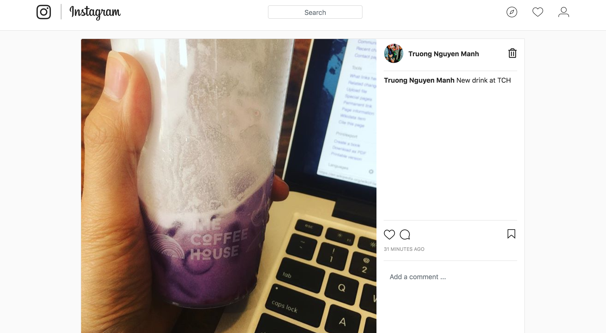
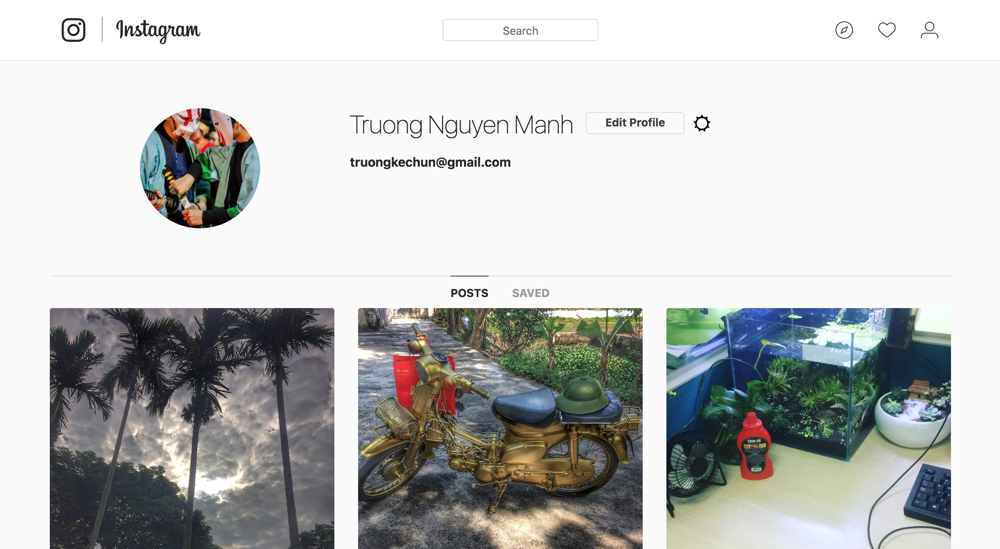
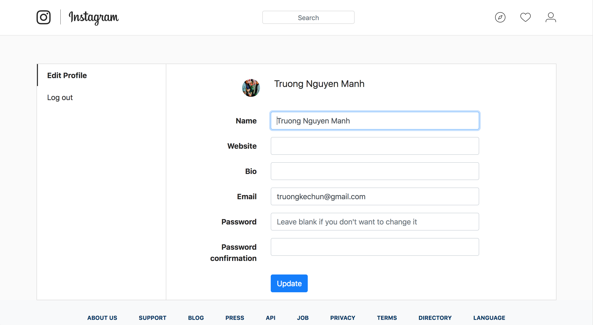

# How to build Instagram using Ruby on Rails

This is source code basic Instagram using Ruby on Rails. This project is built with Ruby on Rails 5.1.6 Ruby 2.5.1 and Bootstrap 4.0.0.

## Site

### Landing Page

User can login using email/password or using social account.

### Home Page

### Post Detail Page

### My Page

### Profile Page

## Built with

- Ruby 2.5
- Rails 5.1.6+
- jQuery - Ajax - jQuery simplifies HTML document traversing, event handling, animating, and Ajax interactions for rapid web development.
- [Bootstrap 4](http://getbootstrap.com/) - Extensive list of components and Bundled Javascript plugins.
- Awesome [Gems](Gemfile)

## [License](LICENSE.md)
